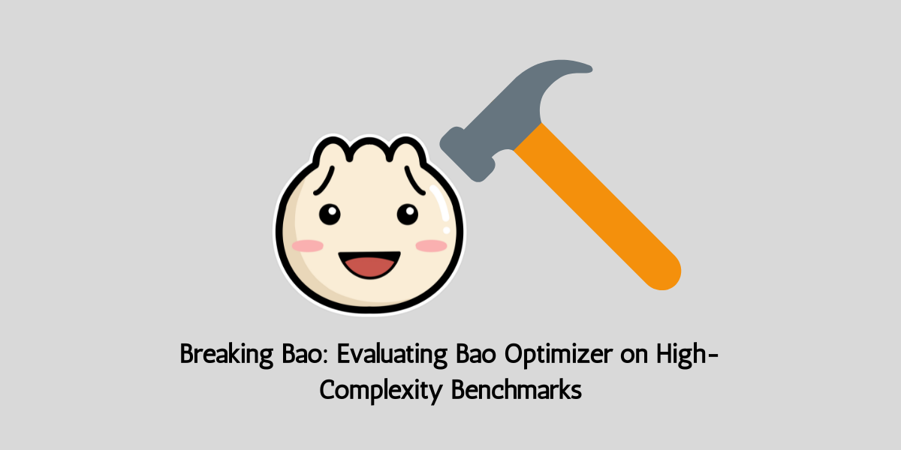

# Breaking Bao: Evaluating Bao Optimizer on High-Complexity Benchmarks  

## Introduction  
Query optimization is a cornerstone of database management systems, critical for efficient data retrieval and processing. This project explores the capabilities and limitations of Bao, a learned query optimizer for PostgreSQL, by testing it on high-complexity benchmarks. We aim to assess Bao’s adaptability and performance in novel scenarios such as skewed data, skewed queries, and dynamic workloads. Our experiments target optimizations in disk I/O, energy efficiency, and cache management while analyzing Bao’s robustness against changes in data and query characteristics.

---

## Tasks  

### **1. Data Transformations I**  
- **Remove/Add Columns (Light Changes)**  
  **IC:** *Vidhi Rambhia*  
  - Experiment with removing or adding `n` columns in datasets.  
  - Analyze how Bao handles schema evolution and dynamic changes.  
  - Visualize results through graphs showcasing the impact on performance.

### **2. Data Transformations II**  
- **Skew Data**  
  **IC:** *Saharsh Barve*  
  - Cluster the dataset into `n` distribution clusters (low and high distances between clusters).  
  - Train Bao on one cluster and evaluate its accuracy on others.  
  - Study performance metrics like execution efficiency and query accuracy.  

---

### **3. Query Transformations**  
- **Skew Query**  
  - Develop skewed query patterns and evaluate Bao’s response using `EXPLAIN`.  
  - Investigate how skew impacts optimization strategies and execution plans.

---

### **4. Optimization Objectives**  
**IC:** *Rahul Bothra*  
- Evaluate Bao’s optimization for:  
  - **Disk I/O**  
  - **Energy efficiency**  
  - **Cache misses**  

---

### **4. Literature Review**  
**IC:** *Omkar Dhekane*  
- Write a 1-page review summarizing related work and papers.  
- Focus on:  
  - Strategies that have "broken" query optimizers.  
  - Comparing our work with Bao and its benchmarks without redundancy.  

---

### **TBD Tasks**  
- Finalize **Writing** sections.  
- Prepare **Slides** for project presentations.  

---

## Team Members  

- **Vidhi Rambhia**: vidhisr2@illinois.edu  
- **Rahul Bothra**: bothra2@illinois.edu  
- **Saharsh Barve**: ssbarve2@illinois.edu  
- **Omkar Dhekane**: dhekane2@illinois.edu  
